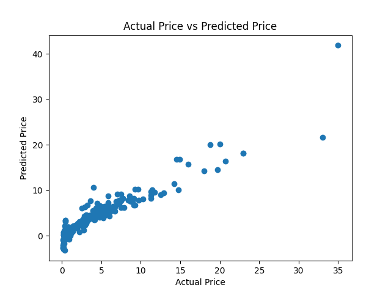
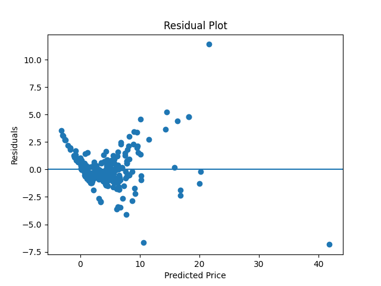

# Car Price Prediction

[](https://www.python.org/)
[](https://numpy.org/)
[](https://pandas.pydata.org/)
[](https://scikit-learn.org/)
[](https://matplotlib.org/)
[](https://jupyter.org/)

## Project Overview

This repository predicts used car selling prices using machine learning. The project compares two models:

* **Linear Regression**
* **Lasso Regression**

Both models use the same dataset and preprocessing steps, and the results are visualized using multiple plots saved to disk.

---

## Repository Structure

```
Car-Price-Prediction/
├─ data/
│  └─ car data.csv
├─ model/
│  ├─ Linear_Regression_model.ipynb
│  └─ Lasso_Regression_model.ipynb
├─ Images/
│  └─ (generated plots for both models)
├─ README.md
└─ requirements.txt
```

* **data/**: Contains the dataset used for training and evaluation.
* **model/**: Jupyter notebooks for Linear Regression and Lasso Regression.
* **Images/**: Saved plots such as Actual vs Predicted and Residual plots.

---

## Dataset

* File: `data/car data.csv`
* Target variable: `Selling_Price`
* Dropped column: `Car_Name`

### Features Used

* `Year`
* `Present_Price`
* `Kms_Driven`
* `Fuel_Type` (encoded)
* `Seller_Type` (encoded)
* `Transmission` (encoded)
* `Owner`

Categorical variables are encoded using **LabelEncoder**.

---

## Workflow

1. Load the dataset using pandas.
2. Perform basic data inspection (`head`, `info`, `shape`, value counts).
3. Encode categorical features.
4. Split data into training and testing sets.
5. Train the model (Linear or Lasso Regression).
6. Evaluate performance using **R² score**.
7. Visualize results and save plots.

---


## Models

### 1. Linear Regression

* Uses `sklearn.linear_model.LinearRegression`
* Serves as a baseline model
* Evaluated using R² score and visual inspection

Generated plots:

* Training Actual vs Predicted
* Test Actual vs Predicted
* Residual Plot

---

### 2. Lasso Regression

* Uses L1 regularization
* Helps reduce overfitting
* Can reduce the impact of less important features

Generated plots:

* Training Actual vs Predicted
* Test Actual vs Predicted
* Residual Plot

---

## Visualizations

The following plots are generated by the notebooks and saved inside the `Images/` directory.

### Linear Regression – Training Data

* **Actual vs Predicted Price**

```text
Images/Linear train data Actual Price vs Predicted Price.png
```



* **Residual Plot**

```text
Images/Linear train data Residual Plot.png
```



---

### Linear Regression – Test Data

* **Actual vs Predicted Price**

```text
Images/Linear test data Actual Price vs Predicted Price.png
```


---

### Linear Regression – Full Dataset

* **Actual vs Predicted Price**

```text
Images/Linear all data Actual Price vs Predicted Price.png
```


---

### Lasso Regression

Similar plots are generated for the Lasso Regression model, including:

* Training Actual vs Predicted
* Test Actual vs Predicted
* Residual Plot

These plots are saved in the same `Images/` directory and follow the same naming convention as the Linear Regression outputs.

---

## How to Use

1. Clone the repository:

```bash
git clone <repo-url>
```

2. Open the notebooks:

* `model/Linear_Regression_model.ipynb`
* `model/Lasso_Regression_model.ipynb`

3. Run cells sequentially to reproduce results and regenerate plots.

---

## Notes & Improvements

* Absolute paths were replaced with relative paths for GitHub compatibility.
* Models currently use simple label encoding; one-hot encoding can be tested for improvement.
* Additional metrics such as MAE and RMSE can be added for deeper evaluation.
* Feature engineering (e.g., car age = current year − Year) may improve performance.

---

## Author

**Fares**

This project is intended for learning, experimentation, and portfolio demonstration.

---

*End of README.*
